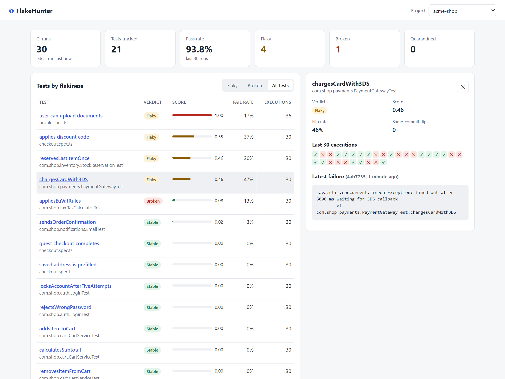
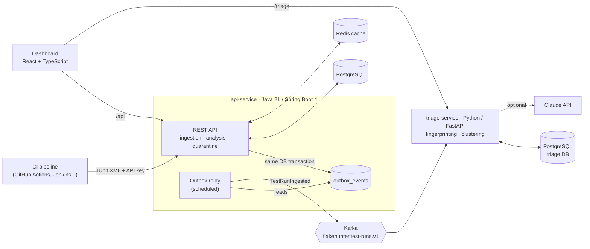

# FlakeHunter

[](https://github.com/tusharxsharma/flakehunter/actions/workflows/ci.yml)
[](https://github.com/tusharxsharma/flakehunter/actions/workflows/codeql.yml)


[](LICENSE)

**Flaky test detection and test analytics for CI pipelines.**

A *flaky test* passes and fails on the same code. Flaky tests waste CI time, train engineers to
ignore red builds, and hide real bugs. At large companies they are a well-known, costly problem.
FlakeHunter finds them automatically:

1. Your CI uploads its **JUnit XML reports** (Maven, Gradle, pytest, Jest, Playwright... all emit them).
2. FlakeHunter scores every test with a **statistical flakiness model** over its recent history
   and labels it `STABLE`, `FLAKY`, `BROKEN` or `INSUFFICIENT_DATA`.
3. Failures are **clustered by root cause** and explained, optionally by Claude.
4. Teams **quarantine** flaky tests through the API, so CI can skip them while they are fixed.



## Architecture



| Component | Stack | Responsibility |
|---|---|---|
| [`services/api-service`](services/api-service) | Java 21, Spring Boot 4, Spring Data JPA, Flyway, PostgreSQL, Redis, Kafka, Spring Security | Ingest reports, score flakiness, quarantine, publish events |
| [`services/triage-service`](services/triage-service) | Python 3.12, FastAPI, SQLAlchemy 2, confluent-kafka, Anthropic SDK | Consume events, fingerprint and cluster failures, explain root causes |
| [`dashboard`](dashboard) | React 19, TypeScript, Vite, nginx | Summary, flaky test ranking, execution timelines, failure clusters |
| [`qa/api-tests`](qa/api-tests) | Java, Cucumber (BDD), REST Assured, JSON Schema | Black-box acceptance tests of the API |
| [`qa/e2e-tests`](qa/e2e-tests) | TypeScript, Playwright, axe-core | End-to-end UI tests (Page Object Model), accessibility, resilience |
| [`qa/performance`](qa/performance) | k6 | Load test with performance budgets |
| [`deploy`](deploy) | Docker Compose, Kubernetes (Kustomize) | Local stack and production manifests |

More detail: [Architecture & design decisions](docs/ARCHITECTURE.md) · [Test strategy](docs/TEST_STRATEGY.md)

## How flakiness is scored

For each test, FlakeHunter looks at its last 30 runs and combines two signals:

- **Same-commit inconsistency**: the test both passed and failed on the *same* commit. The code
  did not change, so the test is non-deterministic. This is the strongest evidence, and it also
  catches "failed, then passed on retry" inside a single build.
- **Recency-weighted flip rate**: how often the result flips between consecutive runs
  (pass→fail or fail→pass). Older flips are down-weighted (decay 0.9 per run), so a test that was
  fixed stops being flagged.

`score = 1 − (1 − flipRate) × (1 − inconsistencyRatio)`. A test is **BROKEN** (a real regression,
not flakiness) if its last 3 runs all failed, and **FLAKY** if the score is ≥ 0.3 or any commit is
inconsistent. The analyzer is a pure function, verified with property-based tests
([`FlakinessAnalyzer.java`](services/api-service/src/main/java/io/flakehunter/api/analysis/FlakinessAnalyzer.java)).

## Quick start

Requires Docker.

```bash
git clone https://github.com/tusharxsharma/flakehunter.git && cd flakehunter
docker compose up -d --build --wait
python scripts/seed_demo.py        # optional: 30 CI runs of a demo project
```

| URL | What |
|---|---|
| http://localhost:3000 | Dashboard |
| http://localhost:8080/swagger-ui.html | API docs (OpenAPI) |
| http://localhost:8000/docs | Triage API docs |

To enable AI root-cause analysis, run `export ANTHROPIC_API_KEY=...` before `docker compose up`.
Without a key, triage uses deterministic rules.

**Without Docker:** `cd services/api-service && ./mvnw spring-boot:test-run` starts the API with an
embedded PostgreSQL (Java 21 is the only requirement).

## Use it from CI

```bash
# once: create a project and keep the API key as a CI secret
curl -X POST localhost:8080/api/v1/projects -H 'Content-Type: application/json' -d '{"name":"my-service"}'

# every build: upload the reports (multiple files become one run)
curl -X POST "$FLAKEHUNTER_URL/api/v1/runs?commitSha=$GITHUB_SHA&branch=$GITHUB_REF_NAME&buildId=$GITHUB_RUN_ID" \
  -H "X-API-Key: $FLAKEHUNTER_API_KEY" \
  -F "files=@target/surefire-reports/TEST-com.example.CartTest.xml" \
  -F "files=@target/surefire-reports/TEST-com.example.PaymentTest.xml"

# skip quarantined tests
curl "$FLAKEHUNTER_URL/api/v1/projects/$PROJECT_ID/quarantine"
```

| Endpoint | Auth | Purpose |
|---|---|---|
| `POST /api/v1/projects` | none | Create a project; returns its API key once |
| `POST /api/v1/runs` | API key | Upload JUnit XML (raw body or multipart). Idempotent per `buildId` |
| `GET /api/v1/projects/{id}` | none | Summary: runs, pass rate, flaky/broken/quarantined counts |
| `GET /api/v1/projects/{id}/tests?verdict=FLAKY` | none | Tests ranked by flakiness score |
| `GET /api/v1/projects/{id}/tests/{testId}` | none | One test's verdict and execution history |
| `PUT/DELETE /api/v1/projects/{id}/tests/{testId}/quarantine` | API key | Quarantine / release a test |
| `GET /api/v1/projects/{id}/quarantine` | none | Quarantine list for CI |
| `GET /triage/api/v1/projects/{id}/clusters` | none | Failure clusters with root-cause hypotheses |

Errors follow [RFC 9457](https://www.rfc-editor.org/rfc/rfc9457) (`application/problem+json`) with a stable `code` field.

## Testing

288 automated tests across every layer, all run in CI on every push:

| Layer | Tool | Count | What it proves |
|---|---|---|---|
| Unit | JUnit 6, AssertJ, Mockito | 73 | Parser, scoring, rate limiter, outbox relay |
| Property-based | jqwik | 7 properties × 1,000 cases | Invariants of the flakiness model hold for *any* history |
| Integration | Spring Boot Test, MockMvc, embedded PostgreSQL + Kafka | 61 | Real SQL, transactions, security, Kafka publishing |
| Python unit/API | pytest, FastAPI TestClient | 74 | Fingerprinting, classification, consumer semantics |
| Frontend | Vitest, React Testing Library | 41 | Components, API client, error states |
| API acceptance | Cucumber + REST Assured + JSON Schema | 24 scenarios | Business behaviour and contracts, black-box |
| End-to-end | Playwright (Page Object Model), axe-core | 15 | Real browser against the full stack; a11y; mocked outages |
| Performance | k6 | 2 scenarios | p95 < 500 ms for uploads, < 300 ms for reads |

Coverage gates fail the build: Java ≥ 85% lines (currently 94%), Python ≥ 90% (97%), dashboard ≥ 80% (96%).

**Dogfooding:** CI uploads the JUnit output of all of these suites to a running FlakeHunter, so the
project analyses its own tests. See [TEST_STRATEGY.md](docs/TEST_STRATEGY.md).

Measured on a laptop (single API instance, 50-test reports): **~3,700 requests/s**, upload
p95 **24 ms**, dashboard reads p95 **18 ms**, 0 errors. In CI, with the whole stack sharing one
GitHub runner: upload p95 104 ms, read p95 88 ms.

## Project layout

```
services/api-service/      Spring Boot API (ingestion, analysis, quarantine, outbox)
services/triage-service/   FastAPI + Kafka consumer (failure clustering, Claude triage)
dashboard/                 React + TypeScript UI, served by nginx
qa/api-tests/              Cucumber + REST Assured acceptance tests
qa/e2e-tests/              Playwright end-to-end tests
qa/performance/            k6 load test
deploy/                    Kubernetes manifests, Postgres init
scripts/                   Demo data, pipeline check, dogfooding
docs/                      Architecture and test strategy
```

## License

[MIT](LICENSE)
